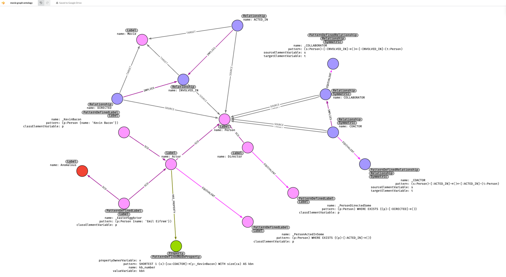

# NeoOWL

**NeoOWL** brings OWL-inspired semantics and reasoning to Neo4j’s LPG, extending some of Jesus Barrasa’s “Going Meta” ([work](https://github.com/jbarrasa/goingmeta/tree/main/session04)).

## Why NeoOWL?

Overcomes RDF/OWL limits (inflexibility, expertise scarcity, slow iteration, transactional gaps) with Neo4j’s flexibility, accessibility, and CDC integration.

## Features

- **Ontology**: Maps OWL constructs (e.g., `rdfs:subClassOf` -> `SCO`) to LPG.
- **Reasoner**: Forward-chaining inference in Python, with full and CDC-driven modes.
- **Real-Time**: Leverages AuraDB CDC.

## Installation

### Prerequisites
- Neo4j AuraDB (Business Critical+)
- Python 3.8+ (`pip install neo4j`)

### Steps
1. Clone: `git clone https://github.com/yourusername/neoowl.git`
2. Configure: Copy `.env.example` to `.env`, set Neo4j credentials.
3. Ingest: `python scripts/ingest_databases.py`

## Usage

- **Ontology**: See `ontologies/human_readable_movie_graph_ontology.cypher` for Movie Graph details.
- **Reasoning**: Run `python notebooks/infer.ipynb` (full: `infer`, incremental: `infer_once`).
- **Queries**: Explore inferred facts (e.g., `MATCH (a:Actor) RETURN a.kb_number`).

## Details

- **Ontology**: Defines `Actor`, `COACTOR`, `kb_number` (see `docs/ontology.txt`).
- **Examples**: 8 Cypher queries in `docs/examples.txt`.
- **Docs**: Full details in `docs/neoowl.txt`.

## Acknowledgments

- Jesus Barrasa
- Neo4j Community

---
*Last Updated: February 20, 2025*